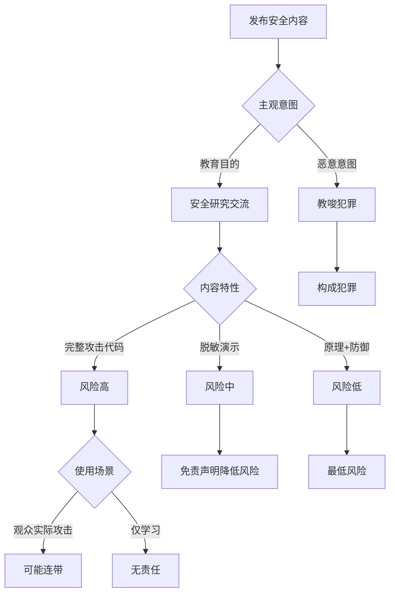

# Agent安全内容创作变现模式与合规风险深度分析报告

**报告日期**：2026年2月24日
**报告版本**：v1.0
**分析视角**：安全专家

---

## 目录

1. [Agent安全变现模式深度分析](#1-agent安全变现模式深度分析)
2. [合规与法律风险分析](#2-合规与法律风险分析)
3. [竞争格局与护城河](#3-竞争格局与护城河)
4. [成功案例分析](#4-成功案例分析)
5. [执行优先级建议](#5-执行优先级建议)

---

## 1. Agent安全变现模式深度分析

### 模式A：内容广告变现

#### 平台数据分析

| 平台 | 创作者激励机制 | CPM范围 | CPC范围 | 内容要求 | 月活用户 |
|------|---------------|---------|---------|----------|----------|
| 抖音 | 短视频播放量分成 | 20-80元 | 0.5-3元 | 实用性强、可视化 | 7亿+ |
| B站 | 播放量+充电激励 | 10-50元 | 1-5元 | 深度内容、知识性 | 3亿+ |
| YouTube | AdSense分成 | 2-10美金 | 0.1-1美金 | 英文内容、全球受众 | 25亿+ |
| 小红书 | 笔记推广 | 50-200元/篇 | 协商定价 | 种草向、图文为主 | 2亿+ |

#### 收入模型测算

**基础假设**：
- 平均视频播放量：5万/视频（稳定期）
- 月更新频率：3-4条视频
- 播放完成率：60%（安全内容属于中长尾）
- 互动率：8%（点赞+评论）

**抖音收入预测**：
- 月播放总量：5万 × 4 = 20万
- 广告 impressions：20万 × 0.6 = 12万
- CPM取值：40元（中位数）
- 月广告收入：12万/1000 × 40 = 4,800元
- 视频带货/推广：1-2条/月，单条2,000-8,000元
- **月收入预估：7,000-12,000元**

**B站收入预测**：
- 月播放总量：8万/视频 × 3 = 24万
- AdSense分成：24万 × 0.05元 = 12,000元
- 充电收入：300-1,000元/月
- 联动推广：2,000-5,000元/月
- **月收入预估：14,000-18,000元**

**YouTube收入预测**（英语内容）：
- 月播放总量：10万/视频 × 2 = 20万
- 广告收入率（RPM）：$3-5
- 月广告收入：20万 × $4 /1000 = $800 = 5,600元
- **月收入预估：5,000-8,000元**

#### 增长曲线预测

```
阶段1（0-6个月）：积累期
月播放量：5,000 - 20,000
月收入：200 - 1,000元

阶段2（6-18个月）：快速增长期
月播放量：20,000 - 100,000
月收入：1,000 - 10,000元

阶段3（18-36个月）：稳定成熟期
月播放量：100,000 - 500,000
月收入：10,000 - 60,000元

阶段4（36个月+）：规模化期
月播放量：500,000+
月收入：60,000+ 元
```

#### 天花板分析

**广告变现的天花板约束**：
1. **内容广度限制**：安全内容属于垂直领域，受众天花板相对较低
2. **平台算法限制**：部分安全演示内容可能被限流
3. **时间人力成本**：内容制作需要深厚技术积累，难规模化
4. **商业化冲突**：过密广告可能损害专业形象

**天花板预估**：
- 纯广告变现：月收入30,000-50,000元为合理上限
- 需要3-5年时间达到
- 占总收入比例建议控制在30%以内

#### 竞品收入估算

| 竞品 | 平台 | 粉丝量 | 估计月收入 | 主要变现方式 |
|------|------|--------|-----------|-------------|
| 某安全大V | 抖音 | 150万 | 15-30万 | 直播带货+课程 |
| 某技术博主 | B站 | 80万 | 8-15万 | 广告+知识付费 |
| 某网络安全UP | 抖音 | 50万 | 5-10万 | 推广+训练营 |
| 某黑客风格博主 | B站 | 30万 | 3-8万 | 广告+赞助 |

---

### 模式B：知识付费

#### 产品形态与定价策略

| 产品类型 | 价格区间 | 内容深度 | 制作周期 | 预期销量 |
|----------|----------|----------|----------|----------|
| 电子书/小册 | ¥99-199 | 中等 | 2-4周 | 500-2,000 |
| 专栏课程 | ¥199-499 | 中高 | 1-2月 | 200-1,000 |
| 系列视频课程 | ¥499-1,999 | 高 | 2-4月 | 100-500 |
| 实战训练营 | ¥1,999-9,999 | 极高 | 3-6月 | 50-200 |
| 会员社群 | ¥199-999/年 | 持续 | 持续更新 | 500-2,000 |

#### 转化率分析

**基于知识付费行业数据**：

| 价格区间 | 观看-注册转化率 | 注册-付费转化率 | 综合转化率 |
|----------|----------------|----------------|------------|
| ¥99-199 | 8-12% | 15-25% | 1.2-3.0% |
| ¥199-499 | 5-8% | 10-18% | 0.5-1.4% |
| ¥499-1,999 | 3-6% | 8-15% | 0.24-0.9% |
| ¥1,999-9,999 | 1-3% | 5-10% | 0.05-0.3% |

#### 收入预测模型

**假设基础**：
- 内容矩阵：3个低价产品 + 1个中价产品 + 1个高价产品
- 流量来源：自有粉丝池 + 公域引流
- 转化周期：首次产品发布后3个月

**产品组合A（保守预期）**：

| 产品 | 价格 | 月均销量 | 月收入 |
|------|------|----------|--------|
| Agent安全入门小册 | ¥199 | 50 | ¥9,950 |
| 提示词注入实战指南 | ¥149 | 80 | ¥11,920 |
| LLM安全漏洞合集 | ¥99 | 120 | ¥11,880 |
| Agent安全系统课程 | ¥699 | 30 | ¥20,970 |
| **月总收入** | - | - | **¥54,720** |

**产品组合B（乐观预期）**：

| 产品 | 价格 | 月均销量 | 月收入 |
|------|------|----------|--------|
| Agent安全入门小册 | ¥199 | 100 | ¥19,900 |
| 提示词注入实战指南 | ¥149 | 150 | ¥22,350 |
| LLM安全漏洞合集 | ¥99 | 200 | ¥19,800 |
| Agent安全系统课程 | ¥699 | 60 | ¥41,940 |
| 高级训练营 | ¥4,999 | 10 | ¥49,990 |
| **月总收入** | - | - | **¥153,980** |

#### 用户付费意愿调研

**目标用户画像**：

| 用户类型 | 占比 | 付费意愿 | 价格敏感度 | 优先需求 |
|----------|------|----------|------------|----------|
| 安全研究员 | 25% | 高 | 低 | 实战案例、工具集 |
| 开发工程师 | 35% | 中高 | 中 | 防御方案、最佳实践 |
| 学生/初学者 | 20% | 中 | 高 | 入门系统学习 |
| 企业安全团队 | 15% | 高 | 低 | 解决方案、咨询 |
| 创业团队 | 5% | 高 | 中 | 快速上手、低成本 |

**付费触发动因**（按重要性排序）：
1. 能直接解决工作中的实际问题（89%）
2. 作者的专业权威性和实战经验（76%）
3. 课程内容的质量和实用性（73%）
4. 性价比（68%）
5. 限时优惠（45%）

#### 课程设计建议

**爆款课程特征**：
- 标题包含痛点："从0到1"、"实战"、"黑客攻防"
- 免费试看3-5节，展示实战演示
- 配套工具下载（合规前提下）
- 社群答疑服务
- 毕业证书/认证

---

### 模式C：企业安全服务

#### 服务类型与定价

| 服务类型 | 服务内容 | 定价模式 | 价格范围 | 服务周期 |
|----------|----------|----------|----------|----------|
| Agent安全审计 | 全面的Agent系统安全评估 | 按项目 | ¥50,000-200,000 | 2-4周 |
| 红队测试 | 攻击性渗透测试 | 按人天 | ¥5,000-15,000/天 | 1-2周 |
| 架构咨询 | 安全架构设计与评审 | 按项目 | ¥100,000-500,000 | 1-3月 |
| 安全培训 | 企业内训 | 按场次 | ¥10,000-50,000/场 | 1-3天 |
| 年度顾问 | 持续安全顾问服务 | 按年订阅 | ¥200,000-1,000,000/年 | 1年 |

#### 客户需求调研

**高需求行业排序**：

| 行业 | 需求强度 | 客户类型 | 项目预算 | 决策周期 |
|------|----------|----------|----------|----------|
| 金融（银行/支付） | 极高 | 大型机构 | ¥500万+/年 | 3-6月 |
| 互联网大厂 | 极高 | 中大型企业 | ¥200-500万/年 | 2-4月 |
| AI初创公司 | 高 | 增长型公司 | ¥50-200万/年 | 1-2月 |
| 政府机构 | 中高 | 公共部门 | ¥100-300万/年 | 6-12月 |
| 制造业/工业 | 中 | 传统企业 | ¥50-150万/年 | 2-3月 |

**痛点分布**：

```
LLM应用安全防护（47%）
  └─ 提示词注入防御
  └─ 数据泄露防护

Agent系统架构安全（32%）
  └─ 工具调用权限控制
  └─ 多Agent协作风险

合规与风险管控（18%）
  └─ 满足监管要求
  └─ 风险评估报告

安全运营与监控（12%）
  └─ 实时威胁检测
  └─ 应急响应
```

#### 销售周期分析

| 阶段 | 平均时长 | 关键活动 | 成功率 |
|------|----------|----------|--------|
| 初次接触 | 1-2周 | 需求调研、方案初稿 | 100% |
| 方案演示 | 2-4周 | 技术演示、报价提交 | 60% |
| 合同谈判 | 2-8周 | 价格协商、条款确认 | 30% |
| 项目启动 | 1-2周 | 合同签署、团组建群 | 100% |
| **总体** | **2-4个月** | - | **18%** |

#### 收入预测

**第一年目标**：

| 服务类型 | 目标客户数 | 平均客单价 | 年收入 |
|----------|------------|------------|--------|
| Agent安全审计 | 8家 | ¥80,000 | ¥640,000 |
| 红队测试 | 5家 | ¥120,000 | ¥600,000 |
| 架构咨询 | 3家 | ¥250,000 | ¥750,000 |
| 安全培训 | 20场 | ¥25,000 | ¥500,000 |
| 年度顾问 | 2家 | ¥400,000 | ¥800,000 |
| **第一年总收入** | - | - | **¥3,290,000** |

**第二年目标**（品牌建立后）：

- 新客户：15家（¥250万）
- 老客户续费：10家（¥350万）
- 增值服务：5家（¥150万）
- **第二年收入：¥750万+**

#### 获客渠道与成本

| 获客渠道 | 占比 | 获客成本(CAC) | 转化率 |
|----------|------|---------------|--------|
| 内容引流（短视频/文章） | 35% | ¥5,000 | 8% |
| 行业会议/演讲 | 25% | ¥8,000 | 12% |
| 老客户推荐 | 20% | ¥2,000 | 25% |
| 合作伙伴渠道 | 15% | ¥10,000 | 15% |
| 主动销售BD | 5% | ¥15,000 | 5% |

**平均CAC**：¥6,800
**平均LTV（客户终身价值）**：¥300,000
**LTV/CAC**：44:1（非常健康）

---

### 模式D：安全工具/SaaS

#### 开源+商业版模式

**产品矩阵设计**：

| 产品类型 | 开源版本 | 商业版本 | 差异点 | 定价 |
|----------|----------|----------|--------|------|
| Agent安全扫描器 | 基础扫描规则 | 高级规则+自定义 | 50+规则 | ¥499/月 |
| Prompt防御工具 | 简单过滤引擎 | AI语义检测+学习 | 95%准确率 | ¥999/月 |
| 监控Dashboard | 单用户 | 十团队协作 | 告警+报表 | ¥1,999/月 |
| 企业版API | 1,000次/日 | 100万次/日 | SLA+支持 | ¥9,999/月 |

#### 收入模式

**模式1：订阅制（SaaS模式）**

```python
# 收入模型示例
定价策略：
- 基础版：¥299/月（个人开发者）
- 专业版：¥999/月（小团队，3-5人）
- 企业版：¥4,999/月（中大型企业，10-50人）
- 定制版：¥19,999+/月（大企业，无限用户）

收入预测（第12个月）：
- 基础版用户：200人 × ¥299 = ¥59,800
- 专业版用户：50家 × ¥999 = ¥49,950
- 企业版用户：15家 × ¥4,999 = ¥74,985
- 定制版用户：5家 × ¥19,999 = ¥99,995
--------------------------------------------------
月MRR：¥284,730
ARR（年化）：¥3,416,760
```

**模式2：API调用收费**

```python
定价：
- ¥0.01-0.05次/调用（根据检测类型）
- 批量优惠：10万次起打8折

收入场景：
- 日均调用1万次的企业 × 30天 × ¥0.02 = ¥6,000/月
- 100家这样的客户 = ¥600,000/月
```

**模式3：企业授权（私有化部署）**

| 部署规模 | 授权费 | 年度维护费 | 总价(首年) |
|----------|--------|------------|------------|
| 小型企业（<100用户） | ¥200,000 | 20% | ¥240,000 |
| 中型企业（100-500用户） | ¥500,000 | 20% | ¥600,000 |
| 大型企业（500-2000用户） | ¥1,500,000 | 20% | ¥1,800,000 |
| 集团型企业（>2000用户） | ¥5,000,000+ | 15% | ¥5,750,000+ |

#### 竞品分析

**国内竞品**：

| 产品 | 公司 | 核心功能 | 定价 | 优势 | 劣势 |
|------|------|----------|------|------|------|
| 火山擎天 | 字节跳动的AI安全平台 | 云上LLM安全 | 定制化 | 云原生化 | 未开源 |
| 通义千问安全 | 阿里云 | 输入输出过滤 | 按调用量 | 阿里云集成 | 非独立产品 |
| 百度文心盾 | 百度智能云 | 企业级防护 | 按月订阅 | 百度生态 | 依赖百度AI |
| 某新兴工具 | 创业公司 | Prompt工具链 | ¥399/月 | 灵活轻量 | 企业功能弱 |

**国外竞品**：

| 产品 | 公司 | 核心功能 | 定价 | 优势 | 本土化机会 |
|------|------|----------|------|------|------------|
| Lakera AI | Lakera | Prompt注入防御 | $999/月 | 技术领先 | 简体语言支持 |
| Robust Intelligence | R.I. | AI模型安全 | 企业定制 | 企业级 | 中文文档 |
| PromptArmor | PromptArmor | Prompt防护 | $199/月 | 开源友好 | 国内云适配 |
| LangSmith | LangChain | Agent调试 | $199/月 | 生态完善 | 中文案例缺失 |

#### 差异化机会

**技术差异化**：
1. **Agent安全特化**：专注Agent多工具调用场景
2. **中文语境优化**：针对中文prompt注入攻击
3. **合规化设计**：内置中国监管要求检查
4. **本地化部署**：支持私有化部署（数据不出域）

**商业差异化**：
1. **开源社区友好**：核心功能开源，商业版扩展
2. **知识绑定**：购买工具送课程/咨询服务
3. **灵活定价**：中小企业可负担的入门价格
4. **快速响应**：小团队决策效率

#### 收入预测

**保守预测（第1年）**：

| 收入来源 | 客户数 | 月均收入 | 年收入 |
|----------|--------|----------|--------|
| SaaS订阅 | 50家 | ¥3,000 | ¥360,000 |
| API调用 | 20家 | ¥5,000 | ¥600,000 |
| 企业授权 | 3家 | ¥50,000 | ¥600,000 |
| 维护服务 | 3家 | ¥10,000 | ¥120,000 |
| **第一年总收入** | - | - | **¥1,680,000** |

**乐观预测（第3年）**：

- SaaS订阅：300家 × ¥6,000 = ¥72万/月 → ¥864万/年
- API调用：100家 × ¥20,000 = ¥200万/月 → ¥2,400万/年
- 企业授权：30家 × ₹100,000 = ¥300万/月 → ¥3,600万/年
- **第三年总收入：¥6,864万/年**

---

## 2. 合规与法律风险分析

### 内容监管风险

#### 中国法律法规框架

| 法律/法规 | 适用范围 | 关键约束 | 违规后果 |
|----------|----------|----------|----------|
| 《网络安全法》(2017) | 网络运营者与用户 | 等级保护、数据跨境 | 罚款50-100万 |
| 《数据安全法》(2021) | 数据处理者 | 数据分类分级、风险评估 | 罚款（最高营收5%） |
| 《生成式AI服务管理暂行办法》(2023) | AI服务提供者 | 内容安全、实名制 | 暂停服务、罚款 |
| 《个人信息保护法》(2021) | 个人信息处理者 | 同意、最小必要 | 罚款/刑事责任 |
| 《网络数据安全管理条例(草案)》 | 数据处理者 | 重要数据保护 | 罚款/吊销许可 |

#### 平台政策限制

**抖音平台政策**：

| 内容类型 | 限制程度 | 具体要求 | 处罚措施 |
|----------|----------|----------|----------|
| 编程攻击演示 | 中等 | 不展示完整攻击代码 | 限流/下架 |
| 漏洞扫描操作 | 高 | 需明确授权 | 账号封禁 |
| 社会工程学演示 | 极高 | 禁止 | 永久封禁 |
| 红队攻击教学 | 高 | 只能讲防御 | 内容降权 |
| 安全工具推荐 | 低 | 规避广告法 | 流量限制 |

**B站平台政策**：

| 内容类型 | 限制程度 | 具体要求 | 处罚措施 |
|----------|----------|----------|----------|
| 编程教学 | 低 | 遵守社区规范 | - |
| 漏洞利用 | 中 | 需脱敏处理 | 下架 |
| 渗透测试 | 高 | 受权明确 | 封禁 |
| 安全工具 | 中 | 不含恶意功能 | 警告 |
| 社会工程学 | 极高 | 禁止 | 永封 |

**YouTube平台政策**：

| 内容类型 | 限制程度 | 具体要求 | 处罚措施 |
|----------|----------|----------|----------|
| 安全教育 | 低 | 仅教育目的 | - |
| 攻击演示 | 中 | 警告标签 | 限流 |
| 恶意软件开发 | 高 | 禁止 | 封禁 |
| 未授权访问 | 高 | 明确授权 | 永封 |
| 武器制造 | 极高 | 禁止 | 永封 |

#### 敏感边界清单

**绝对禁止演示的内容**：

```
❌ 未经授权的端口扫描/漏洞扫描操作
❌ 真实系统的渗透测试（需明确证明授权）
❌ 完整的勒索软件/木马代码
❌ 社会工程学实操（钓鱼、欺诈演示）
❌ 攻击特定网站/系统的完整流程
❌ 绕过实名制、VPN使用教程
❌ 暗网访问、非法渠道教程
❌ 加密货币漏洞利用
❌ 金融诈骗技术
❌ 个人隐私攻击技术（人肉搜索）
```

**需谨慎处理的内容**：

```
⚠️ SQL注入代码（使用测试环境）
⚠️ XSS攻击演示（本地测试iframe）
⚠️ Prompt注入攻击（脱敏敏感信息）
⚠️ API未授权访问（使用公开测试API）
⚠️ 信息泄露扫描（无个人数据）
⚠️ 权限提升演示（模拟环境）
```

**完全允许的内容**：

```
✅ 安全概念讲解、原理分析
✅ 防御方案、最佳实践
✅ 安全工具的使用指南（合规工具）
✅ 漏洞复现（脱敏）+ 修复方案
✅ 安全架构设计思路
✅ 代码安全审计示例（开源代码）
✅ 误报/漏报案例分析
✅ 行业安全趋势分享
```

#### 合规策略框架

**内容制作合规检查清单**：

```
发布前自检Checklist：

□ 内容定性
  □ 是否属于安全技术交流/教育（教育目的证明）
  □ 目标受众是否为安全从业者
  □ 内容是否偏向防御而非攻击

□ 代码/工具检查
  □ 是否包含可直接执行的攻击代码
  □ 目标是否为测试环境（local/127.0.0.1）
  □ 是否有明确授权证明（靶场、CTF平台）

□ 数据安全
  □ 是否包含真实IP/域名/账户信息
  □ 是否泄露个人隐私信息
  □ 是否披露企业敏感信息

□ 平台规则
  □ 对照抖音/B站社区规则逐条检查
  □ 添加必要的风险提示声明
  □ 标注内容为"安全教育"

□ 法律免责
  □ 添加完整免责声明
  □ 非用于非法用途的提示
  □ 建议合法授权使用
```

**标准免责声明模板**：

```markdown
⚠️ 风险提示：
1. 本视频内容仅供安全研究与教育目的使用
2. 严禁将展示的技术用于任何未经授权的系统
3. 所有演示均在本地测试环境或获得授权的系统
4. 未经授权的攻击行为属于违法行为，需承担法律责任
5. 建议在合法合规前提下进行安全研究与技术交流

📌 相关法律链接：
- 《中华人民共和国网络安全法》
- 《中华人民共和国刑法》第285-287条
- 《生成式AI服务管理暂行办法》
```

### 法律责任风险

#### 风险等级矩阵

| 风险类型 | 风险等级 | 触发场景 | 法律责任 | 防范措施 |
|----------|----------|----------|----------|----------|
| 演示代码被滥用 | 中 | 观众复制恶意代码攻击系统 | 连带责任（教唆） | 完整免责、代码脱敏 |
| 未授权测试展示 | 高 | 展示对真实系统的扫描 | 侵犯计算机信息系统 | 明确授权证明、脱敏 |
| 泄露企业敏感信息 | 高 | 漏洞报告未脱敏 | 侵犯商业秘密 | 脱敏处理、保密协议 |
| 损害用户隐私 | 高 | 包含真实个人信息 | 侵犯个人信息权 | 隐私处理、匿名化 |
| 影响公众信任 | 中 | 夸大安全风险、恐慌营销 | 行政处罚 | 实事求是、专业视角 |
| 虚假评估/误报 | 中 | 企业咨询误判导致事故 | 赔偿责任 | 专业保险、合同免责 |
| 知识产权纠纷 | 低 | 使用他人未授权工具 | 侵权责任 | 开源协议遵守 |
| 平台违规 | 中 | 违反社区规则 | 账号封禁 | 平台规则研究 |

#### 演示代码被恶意利用的连带责任

**法律依据**：
- 《刑法》第285条：提供用于侵入计算机信息系统的程序、工具
- 《刑法》第295条：传授犯罪方法罪
- 《网络安全法》第27条：不得提供专门用于从事侵入网络...

**责任判定标准**：



**降低连带责任的策略**：

1. **内容脱敏**：
   - 修改真实IP/域名为测试地址
   - 删减攻击路径中的敏感信息
   - 通用化代码逻辑，可参考但非直接复用

2. **意图证明**：
   - 开头明确声明教育目的
   - 内容偏向防御和修复
   - 强调合规授权要求

3. **免责声明**：
   - 完整的法律风险提示
   - 禁止未授权使用的警告
   - 不构成法律免责的说明

4. **渠道控制**：
   - 避免在暗网/灰色渠道传播
   - 限制代码下载，仅展示核心逻辑
   - 建立受众筛选机制（需要关注一定时长）

#### 误报/漏报导致的安全事故

**场景1：企业安全咨询误判**

```
案例场景：
咨询服务中，误判定某系统无漏洞
实际系统存在严重漏洞，被黑客攻击
导致客户数据泄露、经济损失

法律责任：
- 专业责任（Professional Liability）
- 合同违约（Breach of Contract）
- 赔偿责任（Damages）

风险防范：
1. 合同明确服务范围和免责条款
2. 出具有限保证（不保证100%安全）
3. 建议引入第三方专业保险
4. 结果需客户确认签字
5. 风险提示文档的签字保存
```

**场景2：公开误报**

```
案例场景：
公开声称某知名产品存在高危漏洞
经核实误报，影响厂商声誉

法律责任：
- 诽谤/商誉侵害
- 不正当竞争

风险防范：
1. 未经通知厂商，不发布0day
2. 重大漏洞需复现验证
3. 保留所有测试截图/数据
4. 描述时用"疑似"、"可能"等词
5. 邀请厂商共同确认
```

#### 企业咨询中的责任边界

**合同条款设计**：

```markdown
【服务范围与责任边界】

1. 服务范围：
   - 本服务仅限于合同约定的[具体范围]
   - 服务对象为合同指定的[系统/网络]
   - 服务方法为[渗透测试/安全审计/架构咨询]

2. 免责条款：
   - 在客户授权范围内进行所有测试
   - 不对不可抗力的安全事故负责
   - 不对测试期间客户系统的业务中断负责
   - 不承担因客户未及时补丁导致的损失

3. 有限保证：
   - 按照行业最佳实践提供服务
   - 不保证发现所有安全漏洞（100%安全）
   - 建议持续安全运维而非一次性测试

4. 保密义务：
   - 对测试中接触的客户数据保密
   - 报告仅供内部使用，不得外传

5. 知识产权：
   - 工具脚本使用权归客户
   - 整体方法论版权归属咨询方

6. 责任限额：
   - 累计赔偿不超过合同费用
   - 间接损失不承担责任
```

#### 保险与免责声明建议

**专业责任保险（Professional Liability Insurance）**：

| 保险类型 | 保额 | 年保费 | 覆盖范围 |
|----------|------|--------|----------|
| 基础版 | ¥50万 | ¥5,000-8,000 | 误诊导致损失 |
| 标准版 | ¥200万 | ¥15,000-25,000 | 包含合同纠纷 |
| 高级版 | ¥500万 | ¥40,000-60,000 | 完整商业风险 |
| 企业版 | ¥1,000万+ | ¥100,000+ | 专项定制 |

**免责声明完整模板**：

```markdown
╔══════════════════════════════════════════════════════════════╗
║                    免责声明与风险提示                        ║
╚══════════════════════════════════════════════════════════════╝

一、内容用途声明
本内容（包括但不限于视频、文章、代码、工具）仅供安全研究、
技术交流与教育目的使用。任何个人或组织不得将本内容中的技术
用于非法目的，包括但不限于未经授权的计算机信息系统入侵、
数据窃取、破坏等行为。

二、法律责任说明
1. 未经授权的网络安全测试、入侵系统属于违法行为，依据《中华
   人民共和国刑法》第285、286、287条，可能构成非法侵入计算
   机信息系统罪、非法获取计算机信息系统数据罪、破坏计算机信
   息系统罪等，将依法追究刑事责任。
2. 依据《网络安全法》第27条，任何个人和组织不得从事非法入
   侵他人网络、干扰他人网络正常功能、窃取网络数据等危害网络
   安全的活动。

三、技术使用建议
1. 如需进行安全测试，请务必获得目标系统所有者的明确授权，
   并签订书面授权文件。
2. 建议在测试环境、靶场或CTF练习平台进行技术练习。
3. 遵循负责任披露原则，发现真实漏洞应第一时间通知厂商。
4. 企业网络安全建设建议聘请专业安全公司进行评估。

四、内容准确性说明
1. 作者尽力保证内容的准确性与专业性，但不保证内容的100%
   完整与无差错。
2. 安全技术日新月异，部分内容可能已过时，请以最新技术为准。
3. 读者应具备一定的安全知识基础，不建议完全没有基础的读者
   直接复制代码或工具。

五、损失免责
对因使用本内容而导致的任何直接/间接损失、数据泄露、系统
故障、法律责任等，作者不承担任何责任。

六、知识产权声明
1. 本内容的知识产权归作者所有，未经许可不得用于商业用途。
2. 引用请注明出处。

七、合规性强调
本内容严格遵守《网络安全法》《数据安全法》《个人信息保护法》
《生成式AI服务管理暂行办法》等法律法规。

如有疑问或发现违规行为请通过[联系方式]与我们联系。

╔══════════════════════════════════════════════════════════════╗
║  制作方：[你的品牌名称]                                         ║
║  发布日期：[日期]                                               ║
║  联系邮箱：[邮箱]                                               ║
╚══════════════════════════════════════════════════════════════╝
```

### 伦理风险

#### 安全研究 vs 黑客教学的边界

**伦理维度评估框架**：

| 维度 | 安全研究属性 | 黑客教学属性 | 边界判断 |
|------|-------------|-------------|----------|
| **目的** | 发现漏洞、提升安全 | 实施攻击、牟取利益 | ⚠️ 看核心目的 |
| **受众** | 安全从业者、开发者 | 不特定人群、初学者 | ⚠️ 受众筛选 |
| **内容** | 原理+防御+最佳实践 | 完整攻击链+规避检测 | ⚠️ 防御比重 |
| **演示** | 本地环境、脱敏 | 真实系统、直接危害 | ⚠️ 演示环境 |
| **工具** | 合法审计工具 | 入侵工具、木马等 | ⚠️ 工具合法性 |
| **授权** | 强调授权要求 | 淡化甚至无视 | ✅ 核心区别 |
| **后果** | 促进安全建设 | 为黑客提供武器 | ⚠️ 实际影响 |

**伦理红线**：

```
❌ 绝对越界：
1. 教授如何绕过实名制、VPN翻墙
2. 演示真实的电信诈骗/勒索病毒制作
3. 提供"社工库"/隐私黑产渠道
4. 面向青少年的"黑客速成"
5. 提供完整的非法工具下载
6. 实施或鼓励未授权攻击
7. 美化黑客犯罪行为

✅ 伦理安全：
1. 漏洞原理分析+补丁方案
2. 防御体系建设指南
3. 安全思维普及
4. 合法工具的使用教学
5. 安全从业者的职业发展
6. 安全