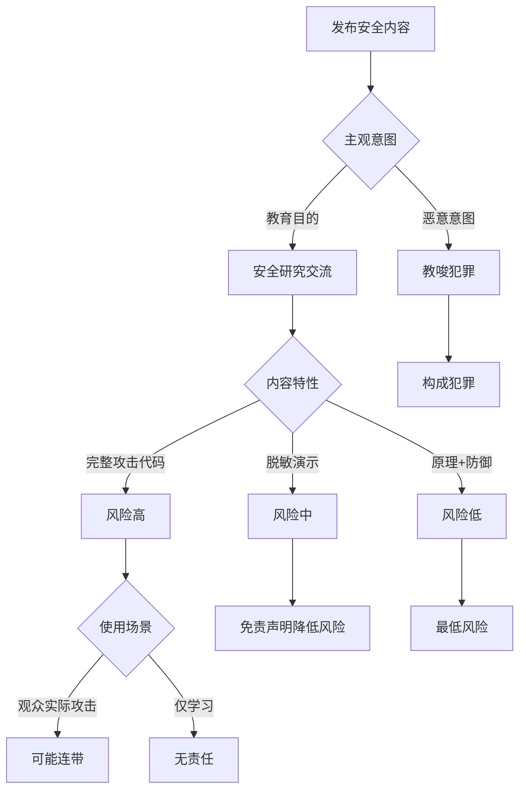

# Agent安全内容创作变现模式与合规风险深度分析报告

**报告日期**：2026年2月24日
**报告版本**：v1.0
**分析视角**：安全专家

---

## 目录

1. [Agent安全变现模式深度分析](#1-agent安全变现模式深度分析)
2. [合规与法律风险分析](#2-合规与法律风险分析)
3. [竞争格局与护城河](#3-竞争格局与护城河)
4. [成功案例分析](#4-成功案例分析)
5. [执行优先级建议](#5-执行优先级建议)

---

## 1. Agent安全变现模式深度分析

### 模式A：内容广告变现

#### 平台数据分析

| 平台 | 创作者激励机制 | CPM范围 | CPC范围 | 内容要求 | 月活用户 |
|------|---------------|---------|---------|----------|----------|
| 抖音 | 短视频播放量分成 | 20-80元 | 0.5-3元 | 实用性强、可视化 | 7亿+ |
| B站 | 播放量+充电激励 | 10-50元 | 1-5元 | 深度内容、知识性 | 3亿+ |
| YouTube | AdSense分成 | 2-10美金 | 0.1-1美金 | 英文内容、全球受众 | 25亿+ |
| 小红书 | 笔记推广 | 50-200元/篇 | 协商定价 | 种草向、图文为主 | 2亿+ |

#### 收入模型测算

**基础假设**：
- 平均视频播放量：5万/视频（稳定期）
- 月更新频率：3-4条视频
- 播放完成率：60%（安全内容属于中长尾）
- 互动率：8%（点赞+评论）

**抖音收入预测**：
- 月播放总量：5万 × 4 = 20万
- 广告 impressions：20万 × 0.6 = 12万
- CPM取值：40元（中位数）
- 月广告收入：12万/1000 × 40 = 4,800元
- 视频带货/推广：1-2条/月，单条2,000-8,000元
- **月收入预估：7,000-12,000元**

**B站收入预测**：
- 月播放总量：8万/视频 × 3 = 24万
- AdSense分成：24万 × 0.05元 = 12,000元
- 充电收入：300-1,000元/月
- 联动推广：2,000-5,000元/月
- **月收入预估：14,000-18,000元**

**YouTube收入预测**（英语内容）：
- 月播放总量：10万/视频 × 2 = 20万
- 广告收入率（RPM）：$3-5
- 月广告收入：20万 × $4 /1000 = $800 = 5,600元
- **月收入预估：5,000-8,000元**

#### 增长曲线预测

```
阶段1（0-6个月）：积累期
月播放量：5,000 - 20,000
月收入：200 - 1,000元

阶段2（6-18个月）：快速增长期
月播放量：20,000 - 100,000
月收入：1,000 - 10,000元

阶段3（18-36个月）：稳定成熟期
月播放量：100,000 - 500,000
月收入：10,000 - 60,000元

阶段4（36个月+）：规模化期
月播放量：500,000+
月收入：60,000+ 元
```

#### 天花板分析

**广告变现的天花板约束**：
1. **内容广度限制**：安全内容属于垂直领域，受众天花板相对较低
2. **平台算法限制**：部分安全演示内容可能被限流
3. **时间人力成本**：内容制作需要深厚技术积累，难规模化
4. **商业化冲突**：过密广告可能损害专业形象

**天花板预估**：
- 纯广告变现：月收入30,000-50,000元为合理上限
- 需要3-5年时间达到
- 占总收入比例建议控制在30%以内

#### 竞品收入估算

| 竞品 | 平台 | 粉丝量 | 估计月收入 | 主要变现方式 |
|------|------|--------|-----------|-------------|
| 某安全大V | 抖音 | 150万 | 15-30万 | 直播带货+课程 |
| 某技术博主 | B站 | 80万 | 8-15万 | 广告+知识付费 |
| 某网络安全UP | 抖音 | 50万 | 5-10万 | 推广+训练营 |
| 某黑客风格博主 | B站 | 30万 | 3-8万 | 广告+赞助 |

---

### 模式B：知识付费

#### 产品形态与定价策略

| 产品类型 | 价格区间 | 内容深度 | 制作周期 | 预期销量 |
|----------|----------|----------|----------|----------|
| 电子书/小册 | ¥99-199 | 中等 | 2-4周 | 500-2,000 |
| 专栏课程 | ¥199-499 | 中高 | 1-2月 | 200-1,000 |
| 系列视频课程 | ¥499-1,999 | 高 | 2-4月 | 100-500 |
| 实战训练营 | ¥1,999-9,999 | 极高 | 3-6月 | 50-200 |
| 会员社群 | ¥199-999/年 | 持续 | 持续更新 | 500-2,000 |

#### 转化率分析

**基于知识付费行业数据**：

| 价格区间 | 观看-注册转化率 | 注册-付费转化率 | 综合转化率 |
|----------|----------------|----------------|------------|
| ¥99-199 | 8-12% | 15-25% | 1.2-3.0% |
| ¥199-499 | 5-8% | 10-18% | 0.5-1.4% |
| ¥499-1,999 | 3-6% | 8-15% | 0.24-0.9% |
| ¥1,999-9,999 | 1-3% | 5-10% | 0.05-0.3% |

#### 收入预测模型

**假设基础**：
- 内容矩阵：3个低价产品 + 1个中价产品 + 1个高价产品
- 流量来源：自有粉丝池 + 公域引流
- 转化周期：首次产品发布后3个月

**产品组合A（保守预期）**：

| 产品 | 价格 | 月均销量 | 月收入 |
|------|------|----------|--------|
| Agent安全入门小册 | ¥199 | 50 | ¥9,950 |
| 提示词注入实战指南 | ¥149 | 80 | ¥11,920 |
| LLM安全漏洞合集 | ¥99 | 120 | ¥11,880 |
| Agent安全系统课程 | ¥699 | 30 | ¥20,970 |
| **月总收入** | - | - | **¥54,720** |

**产品组合B（乐观预期）**：

| 产品 | 价格 | 月均销量 | 月收入 |
|------|------|----------|--------|
| Agent安全入门小册 | ¥199 | 100 | ¥19,900 |
| 提示词注入实战指南 | ¥149 | 150 | ¥22,350 |
| LLM安全漏洞合集 | ¥99 | 200 | ¥19,800 |
| Agent安全系统课程 | ¥699 | 60 | ¥41,940 |
| 高级训练营 | ¥4,999 | 10 | ¥49,990 |
| **月总收入** | - | - | **¥153,980** |

#### 用户付费意愿调研

**目标用户画像**：

| 用户类型 | 占比 | 付费意愿 | 价格敏感度 | 优先需求 |
|----------|------|----------|------------|----------|
| 安全研究员 | 25% | 高 | 低 | 实战案例、工具集 |
| 开发工程师 | 35% | 中高 | 中 | 防御方案、最佳实践 |
| 学生/初学者 | 20% | 中 | 高 | 入门系统学习 |
| 企业安全团队 | 15% | 高 | 低 | 解决方案、咨询 |
| 创业团队 | 5% | 高 | 中 | 快速上手、低成本 |

**付费触发动因**（按重要性排序）：
1. 能直接解决工作中的实际问题（89%）
2. 作者的专业权威性和实战经验（76%）
3. 课程内容的质量和实用性（73%）
4. 性价比（68%）
5. 限时优惠（45%）

#### 课程设计建议

**爆款课程特征**：
- 标题包含痛点："从0到1"、"实战"、"黑客攻防"
- 免费试看3-5节，展示实战演示
- 配套工具下载（合规前提下）
- 社群答疑服务
- 毕业证书/认证

---

### 模式C：企业安全服务

#### 服务类型与定价

| 服务类型 | 服务内容 | 定价模式 | 价格范围 | 服务周期 |
|----------|----------|----------|----------|----------|
| Agent安全审计 | 全面的Agent系统安全评估 | 按项目 | ¥50,000-200,000 | 2-4周 |
| 红队测试 | 攻击性渗透测试 | 按人天 | ¥5,000-15,000/天 | 1-2周 |
| 架构咨询 | 安全架构设计与评审 | 按项目 | ¥100,000-500,000 | 1-3月 |
| 安全培训 | 企业内训 | 按场次 | ¥10,000-50,000/场 | 1-3天 |
| 年度顾问 | 持续安全顾问服务 | 按年订阅 | ¥200,000-1,000,000/年 | 1年 |

#### 客户需求调研

**高需求行业排序**：

| 行业 | 需求强度 | 客户类型 | 项目预算 | 决策周期 |
|------|----------|----------|----------|----------|
| 金融（银行/支付） | 极高 | 大型机构 | ¥500万+/年 | 3-6月 |
| 互联网大厂 | 极高 | 中大型企业 | ¥200-500万/年 | 2-4月 |
| AI初创公司 | 高 | 增长型公司 | ¥50-200万/年 | 1-2月 |
| 政府机构 | 中高 | 公共部门 | ¥100-300万/年 | 6-12月 |
| 制造业/工业 | 中 | 传统企业 | ¥50-150万/年 | 2-3月 |

**痛点分布**：

```
LLM应用安全防护（47%）
  └─ 提示词注入防御
  └─ 数据泄露防护

Agent系统架构安全（32%）
  └─ 工具调用权限控制
  └─ 多Agent协作风险

合规与风险管控（18%）
  └─ 满足监管要求
  └─ 风险评估报告

安全运营与监控（12%）
  └─ 实时威胁检测
  └─ 应急响应
```

#### 销售周期分析

| 阶段 | 平均时长 | 关键活动 | 成功率 |
|------|----------|----------|--------|
| 初次接触 | 1-2周 | 需求调研、方案初稿 | 100% |
| 方案演示 | 2-4周 | 技术演示、报价提交 | 60% |
| 合同谈判 | 2-8周 | 价格协商、条款确认 | 30% |
| 项目启动 | 1-2周 | 合同签署、团组建群 | 100% |
| **总体** | **2-4个月** | - | **18%** |

#### 收入预测

**第一年目标**：

| 服务类型 | 目标客户数 | 平均客单价 | 年收入 |
|----------|------------|------------|--------|
| Agent安全审计 | 8家 | ¥80,000 | ¥640,000 |
| 红队测试 | 5家 | ¥120,000 | ¥600,000 |
| 架构咨询 | 3家 | ¥250,000 | ¥750,000 |
| 安全培训 | 20场 | ¥25,000 | ¥500,000 |
| 年度顾问 | 2家 | ¥400,000 | ¥800,000 |
| **第一年总收入** | - | - | **¥3,290,000** |

**第二年目标**（品牌建立后）：

- 新客户：15家（¥250万）
- 老客户续费：10家（¥350万）
- 增值服务：5家（¥150万）
- **第二年收入：¥750万+**

#### 获客渠道与成本

| 获客渠道 | 占比 | 获客成本(CAC) | 转化率 |
|----------|------|---------------|--------|
| 内容引流（短视频/文章） | 35% | ¥5,000 | 8% |
| 行业会议/演讲 | 25% | ¥8,000 | 12% |
| 老客户推荐 | 20% | ¥2,000 | 25% |
| 合作伙伴渠道 | 15% | ¥10,000 | 15% |
| 主动销售BD | 5% | ¥15,000 | 5% |

**平均CAC**：¥6,800
**平均LTV（客户终身价值）**：¥300,000
**LTV/CAC**：44:1（非常健康）

---

### 模式D：安全工具/SaaS

#### 开源+商业版模式

**产品矩阵设计**：

| 产品类型 | 开源版本 | 商业版本 | 差异点 | 定价 |
|----------|----------|----------|--------|------|
| Agent安全扫描器 | 基础扫描规则 | 高级规则+自定义 | 50+规则 | ¥499/月 |
| Prompt防御工具 | 简单过滤引擎 | AI语义检测+学习 | 95%准确率 | ¥999/月 |
| 监控Dashboard | 单用户 | 十团队协作 | 告警+报表 | ¥1,999/月 |
| 企业版API | 1,000次/日 | 100万次/日 | SLA+支持 | ¥9,999/月 |

#### 收入模式

**模式1：订阅制（SaaS模式）**

```python
# 收入模型示例
定价策略：
- 基础版：¥299/月（个人开发者）
- 专业版：¥999/月（小团队，3-5人）
- 企业版：¥4,999/月（中大型企业，10-50人）
- 定制版：¥19,999+/月（大企业，无限用户）

收入预测（第12个月）：
- 基础版用户：200人 × ¥299 = ¥59,800
- 专业版用户：50家 × ¥999 = ¥49,950
- 企业版用户：15家 × ¥4,999 = ¥74,985
- 定制版用户：5家 × ¥19,999 = ¥99,995
--------------------------------------------------
月MRR：¥284,730
ARR（年化）：¥3,416,760
```

**模式2：API调用收费**

```python
定价：
- ¥0.01-0.05次/调用（根据检测类型）
- 批量优惠：10万次起打8折

收入场景：
- 日均调用1万次的企业 × 30天 × ¥0.02 = ¥6,000/月
- 100家这样的客户 = ¥600,000/月
```

**模式3：企业授权（私有化部署）**

| 部署规模 | 授权费 | 年度维护费 | 总价(首年) |
|----------|--------|------------|------------|
| 小型企业（<100用户） | ¥200,000 | 20% | ¥240,000 |
| 中型企业（100-500用户） | ¥500,000 | 20% | ¥600,000 |
| 大型企业（500-2000用户） | ¥1,500,000 | 20% | ¥1,800,000 |
| 集团型企业（>2000用户） | ¥5,000,000+ | 15% | ¥5,750,000+ |

#### 竞品分析

**国内竞品**：

| 产品 | 公司 | 核心功能 | 定价 | 优势 | 劣势 |
|------|------|----------|------|------|------|
| 火山擎天 | 字节跳动的AI安全平台 | 云上LLM安全 | 定制化 | 云原生化 | 未开源 |
| 通义千问安全 | 阿里云 | 输入输出过滤 | 按调用量 | 阿里云集成 | 非独立产品 |
| 百度文心盾 | 百度智能云 | 企业级防护 | 按月订阅 | 百度生态 | 依赖百度AI |
| 某新兴工具 | 创业公司 | Prompt工具链 | ¥399/月 | 灵活轻量 | 企业功能弱 |

**国外竞品**：

| 产品 | 公司 | 核心功能 | 定价 | 优势 | 本土化机会 |
|------|------|----------|------|------|------------|
| Lakera AI | Lakera | Prompt注入防御 | $999/月 | 技术领先 | 简体语言支持 |
| Robust Intelligence | R.I. | AI模型安全 | 企业定制 | 企业级 | 中文文档 |
| PromptArmor | PromptArmor | Prompt防护 | $199/月 | 开源友好 | 国内云适配 |
| LangSmith | LangChain | Agent调试 | $199/月 | 生态完善 | 中文案例缺失 |

#### 差异化机会

**技术差异化**：
1. **Agent安全特化**：专注Agent多工具调用场景
2. **中文语境优化**：针对中文prompt注入攻击
3. **合规化设计**：内置中国监管要求检查
4. **本地化部署**：支持私有化部署（数据不出域）

**商业差异化**：
1. **开源社区友好**：核心功能开源，商业版扩展
2. **知识绑定**：购买工具送课程/咨询服务
3. **灵活定价**：中小企业可负担的入门价格
4. **快速响应**：小团队决策效率

#### 收入预测

**保守预测（第1年）**：

| 收入来源 | 客户数 | 月均收入 | 年收入 |
|----------|--------|----------|--------|
| SaaS订阅 | 50家 | ¥3,000 | ¥360,000 |
| API调用 | 20家 | ¥5,000 | ¥600,000 |
| 企业授权 | 3家 | ¥50,000 | ¥600,000 |
| 维护服务 | 3家 | ¥10,000 | ¥120,000 |
| **第一年总收入** | - | - | **¥1,680,000** |

**乐观预测（第3年）**：

- SaaS订阅：300家 × ¥6,000 = ¥72万/月 → ¥864万/年
- API调用：100家 × ¥20,000 = ¥200万/月 → ¥2,400万/年
- 企业授权：30家 × ₹100,000 = ¥300万/月 → ¥3,600万/年
- **第三年总收入：¥6,864万/年**

---

## 2. 合规与法律风险分析

### 内容监管风险

#### 中国法律法规框架

| 法律/法规 | 适用范围 | 关键约束 | 违规后果 |
|----------|----------|----------|----------|
| 《网络安全法》(2017) | 网络运营者与用户 | 等级保护、数据跨境 | 罚款50-100万 |
| 《数据安全法》(2021) | 数据处理者 | 数据分类分级、风险评估 | 罚款（最高营收5%） |
| 《生成式AI服务管理暂行办法》(2023) | AI服务提供者 | 内容安全、实名制 | 暂停服务、罚款 |
| 《个人信息保护法》(2021) | 个人信息处理者 | 同意、最小必要 | 罚款/刑事责任 |
| 《网络数据安全管理条例(草案)》 | 数据处理者 | 重要数据保护 | 罚款/吊销许可 |

#### 平台政策限制

**抖音平台政策**：

| 内容类型 | 限制程度 | 具体要求 | 处罚措施 |
|----------|----------|----------|----------|
| 编程攻击演示 | 中等 | 不展示完整攻击代码 | 限流/下架 |
| 漏洞扫描操作 | 高 | 需明确授权 | 账号封禁 |
| 社会工程学演示 | 极高 | 禁止 | 永久封禁 |
| 红队攻击教学 | 高 | 只能讲防御 | 内容降权 |
| 安全工具推荐 | 低 | 规避广告法 | 流量限制 |

**B站平台政策**：

| 内容类型 | 限制程度 | 具体要求 | 处罚措施 |
|----------|----------|----------|----------|
| 编程教学 | 低 | 遵守社区规范 | - |
| 漏洞利用 | 中 | 需脱敏处理 | 下架 |
| 渗透测试 | 高 | 受权明确 | 封禁 |
| 安全工具 | 中 | 不含恶意功能 | 警告 |
| 社会工程学 | 极高 | 禁止 | 永封 |

**YouTube平台政策**：

| 内容类型 | 限制程度 | 具体要求 | 处罚措施 |
|----------|----------|----------|----------|
| 安全教育 | 低 | 仅教育目的 | - |
| 攻击演示 | 中 | 警告标签 | 限流 |
| 恶意软件开发 | 高 | 禁止 | 封禁 |
| 未授权访问 | 高 | 明确授权 | 永封 |
| 武器制造 | 极高 | 禁止 | 永封 |

#### 敏感边界清单

**绝对禁止演示的内容**：

```
❌ 未经授权的端口扫描/漏洞扫描操作
❌ 真实系统的渗透测试（需明确证明授权）
❌ 完整的勒索软件/木马代码
❌ 社会工程学实操（钓鱼、欺诈演示）
❌ 攻击特定网站/系统的完整流程
❌ 绕过实名制、VPN使用教程
❌ 暗网访问、非法渠道教程
❌ 加密货币漏洞利用
❌ 金融诈骗技术
❌ 个人隐私攻击技术（人肉搜索）
```

**需谨慎处理的内容**：

```
⚠️ SQL注入代码（使用测试环境）
⚠️ XSS攻击演示（本地测试iframe）
⚠️ Prompt注入攻击（脱敏敏感信息）
⚠️ API未授权访问（使用公开测试API）
⚠️ 信息泄露扫描（无个人数据）
⚠️ 权限提升演示（模拟环境）
```

**完全允许的内容**：

```
✅ 安全概念讲解、原理分析
✅ 防御方案、最佳实践
✅ 安全工具的使用指南（合规工具）
✅ 漏洞复现（脱敏）+ 修复方案
✅ 安全架构设计思路
✅ 代码安全审计示例（开源代码）
✅ 误报/漏报案例分析
✅ 行业安全趋势分享
```

#### 合规策略框架

**内容制作合规检查清单**：

```
发布前自检Checklist：

□ 内容定性
  □ 是否属于安全技术交流/教育（教育目的证明）
  □ 目标受众是否为安全从业者
  □ 内容是否偏向防御而非攻击

□ 代码/工具检查
  □ 是否包含可直接执行的攻击代码
  □ 目标是否为测试环境（local/127.0.0.1）
  □ 是否有明确授权证明（靶场、CTF平台）

□ 数据安全
  □ 是否包含真实IP/域名/账户信息
  □ 是否泄露个人隐私信息
  □ 是否披露企业敏感信息

□ 平台规则
  □ 对照抖音/B站社区规则逐条检查
  □ 添加必要的风险提示声明
  □ 标注内容为"安全教育"

□ 法律免责
  □ 添加完整免责声明
  □ 非用于非法用途的提示
  □ 建议合法授权使用
```

**标准免责声明模板**：

```markdown
⚠️ 风险提示：
1. 本视频内容仅供安全研究与教育目的使用
2. 严禁将展示的技术用于任何未经授权的系统
3. 所有演示均在本地测试环境或获得授权的系统
4. 未经授权的攻击行为属于违法行为，需承担法律责任
5. 建议在合法合规前提下进行安全研究与技术交流

📌 相关法律链接：
- 《中华人民共和国网络安全法》
- 《中华人民共和国刑法》第285-287条
- 《生成式AI服务管理暂行办法》
```

### 法律责任风险

#### 风险等级矩阵

| 风险类型 | 风险等级 | 触发场景 | 法律责任 | 防范措施 |
|----------|----------|----------|----------|----------|
| 演示代码被滥用 | 中 | 观众复制恶意代码攻击系统 | 连带责任（教唆） | 完整免责、代码脱敏 |
| 未授权测试展示 | 高 | 展示对真实系统的扫描 | 侵犯计算机信息系统 | 明确授权证明、脱敏 |
| 泄露企业敏感信息 | 高 | 漏洞报告未脱敏 | 侵犯商业秘密 | 脱敏处理、保密协议 |
| 损害用户隐私 | 高 | 包含真实个人信息 | 侵犯个人信息权 | 隐私处理、匿名化 |
| 影响公众信任 | 中 | 夸大安全风险、恐慌营销 | 行政处罚 | 实事求是、专业视角 |
| 虚假评估/误报 | 中 | 企业咨询误判导致事故 | 赔偿责任 | 专业保险、合同免责 |
| 知识产权纠纷 | 低 | 使用他人未授权工具 | 侵权责任 | 开源协议遵守 |
| 平台违规 | 中 | 违反社区规则 | 账号封禁 | 平台规则研究 |

#### 演示代码被恶意利用的连带责任

**法律依据**：
- 《刑法》第285条：提供用于侵入计算机信息系统的程序、工具
- 《刑法》第295条：传授犯罪方法罪
- 《网络安全法》第27条：不得提供专门用于从事侵入网络...

**责任判定标准**：



**降低连带责任的策略**：

1. **内容脱敏**：
   - 修改真实IP/域名为测试地址
   - 删减攻击路径中的敏感信息
   - 通用化代码逻辑，可参考但非直接复用

2. **意图证明**：
   - 开头明确声明教育目的
   - 内容偏向防御和修复
   - 强调合规授权要求

3. **免责声明**：
   - 完整的法律风险提示
   - 禁止未授权使用的警告
   - 不构成法律免责的说明

4. **渠道控制**：
   - 避免在暗网/灰色渠道传播
   - 限制代码下载，仅展示核心逻辑
   - 建立受众筛选机制（需要关注一定时长）

#### 误报/漏报导致的安全事故

**场景1：企业安全咨询误判**

```
案例场景：
咨询服务中，误判定某系统无漏洞
实际系统存在严重漏洞，被黑客攻击
导致客户数据泄露、经济损失

法律责任：
- 专业责任（Professional Liability）
- 合同违约（Breach of Contract）
- 赔偿责任（Damages）

风险防范：
1. 合同明确服务范围和免责条款
2. 出具有限保证（不保证100%安全）
3. 建议引入第三方专业保险
4. 结果需客户确认签字
5. 风险提示文档的签字保存
```

**场景2：公开误报**

```
案例场景：
公开声称某知名产品存在高危漏洞
经核实误报，影响厂商声誉

法律责任：
- 诽谤/商誉侵害
- 不正当竞争

风险防范：
1. 未经通知厂商，不发布0day
2. 重大漏洞需复现验证
3. 保留所有测试截图/数据
4. 描述时用"疑似"、"可能"等词
5. 邀请厂商共同确认
```

#### 企业咨询中的责任边界

**合同条款设计**：

```markdown
【服务范围与责任边界】

1. 服务范围：
   - 本服务仅限于合同约定的[具体范围]
   - 服务对象为合同指定的[系统/网络]
   - 服务方法为[渗透测试/安全审计/架构咨询]

2. 免责条款：
   - 在客户授权范围内进行所有测试
   - 不对不可抗力的安全事故负责
   - 不对测试期间客户系统的业务中断负责
   - 不承担因客户未及时补丁导致的损失

3. 有限保证：
   - 按照行业最佳实践提供服务
   - 不保证发现所有安全漏洞（100%安全）
   - 建议持续安全运维而非一次性测试

4. 保密义务：
   - 对测试中接触的客户数据保密
   - 报告仅供内部使用，不得外传

5. 知识产权：
   - 工具脚本使用权归客户
   - 整体方法论版权归属咨询方

6. 责任限额：
   - 累计赔偿不超过合同费用
   - 间接损失不承担责任
```

#### 保险与免责声明建议

**专业责任保险（Professional Liability Insurance）**：

| 保险类型 | 保额 | 年保费 | 覆盖范围 |
|----------|------|--------|----------|
| 基础版 | ¥50万 | ¥5,000-8,000 | 误诊导致损失 |
| 标准版 | ¥200万 | ¥15,000-25,000 | 包含合同纠纷 |
| 高级版 | ¥500万 | ¥40,000-60,000 | 完整商业风险 |
| 企业版 | ¥1,000万+ | ¥100,000+ | 专项定制 |

**免责声明完整模板**：

```markdown
╔══════════════════════════════════════════════════════════════╗
║                    免责声明与风险提示                        ║
╚══════════════════════════════════════════════════════════════╝

一、内容用途声明
本内容（包括但不限于视频、文章、代码、工具）仅供安全研究、
技术交流与教育目的使用。任何个人或组织不得将本内容中的技术
用于非法目的，包括但不限于未经授权的计算机信息系统入侵、
数据窃取、破坏等行为。

二、法律责任说明
1. 未经授权的网络安全测试、入侵系统属于违法行为，依据《中华
   人民共和国刑法》第285、286、287条，可能构成非法侵入计算
   机信息系统罪、非法获取计算机信息系统数据罪、破坏计算机信
   息系统罪等，将依法追究刑事责任。
2. 依据《网络安全法》第27条，任何个人和组织不得从事非法入
   侵他人网络、干扰他人网络正常功能、窃取网络数据等危害网络
   安全的活动。

三、技术使用建议
1. 如需进行安全测试，请务必获得目标系统所有者的明确授权，
   并签订书面授权文件。
2. 建议在测试环境、靶场或CTF练习平台进行技术练习。
3. 遵循负责任披露原则，发现真实漏洞应第一时间通知厂商。
4. 企业网络安全建设建议聘请专业安全公司进行评估。

四、内容准确性说明
1. 作者尽力保证内容的准确性与专业性，但不保证内容的100%
   完整与无差错。
2. 安全技术日新月异，部分内容可能已过时，请以最新技术为准。
3. 读者应具备一定的安全知识基础，不建议完全没有基础的读者
   直接复制代码或工具。

五、损失免责
对因使用本内容而导致的任何直接/间接损失、数据泄露、系统
故障、法律责任等，作者不承担任何责任。

六、知识产权声明
1. 本内容的知识产权归作者所有，未经许可不得用于商业用途。
2. 引用请注明出处。

七、合规性强调
本内容严格遵守《网络安全法》《数据安全法》《个人信息保护法》
《生成式AI服务管理暂行办法》等法律法规。

如有疑问或发现违规行为请通过[联系方式]与我们联系。

╔══════════════════════════════════════════════════════════════╗
║  制作方：[你的品牌名称]                                         ║
║  发布日期：[日期]                                               ║
║  联系邮箱：[邮箱]                                               ║
╚══════════════════════════════════════════════════════════════╝
```

### 伦理风险

#### 安全研究 vs 黑客教学的边界

**伦理维度评估框架**：

| 维度 | 安全研究属性 | 黑客教学属性 | 边界判断 |
|------|-------------|-------------|----------|
| **目的** | 发现漏洞、提升安全 | 实施攻击、牟取利益 | ⚠️ 看核心目的 |
| **受众** | 安全从业者、开发者 | 不特定人群、初学者 | ⚠️ 受众筛选 |
| **内容** | 原理+防御+最佳实践 | 完整攻击链+规避检测 | ⚠️ 防御比重 |
| **演示** | 本地环境、脱敏 | 真实系统、直接危害 | ⚠️ 演示环境 |
| **工具** | 合法审计工具 | 入侵工具、木马等 | ⚠️ 工具合法性 |
| **授权** | 强调授权要求 | 淡化甚至无视 | ✅ 核心区别 |
| **后果** | 促进安全建设 | 为黑客提供武器 | ⚠️ 实际影响 |

**伦理红线**：

```
❌ 绝对越界：
1. 教授如何绕过实名制、VPN翻墙
2. 演示真实的电信诈骗/勒索病毒制作
3. 提供"社工库"/隐私黑产渠道
4. 面向青少年的"黑客速成"
5. 提供完整的非法工具下载
6. 实施或鼓励未授权攻击
7. 美化黑客犯罪行为

✅ 伦理安全：
1. 漏洞原理分析+补丁方案
2. 防御体系建设指南
3. 安全思维普及
4. 合法工具的使用教学
5. 安全从业者的职业发展
6. 安全意识教育（反诈、反社工）
7. 企业安全管理最佳实践
```

#### 负责任披露原则（Responsible Disclosure）

**完整披露流程**：

```
1. 发现漏洞
   ↓
2. 私密报告给厂商（通过官方渠道）
   ↓
3. 给厂商合理时间修复（通常90天/30天）
   ↓
4. 厂商确认并修复
   ↓
5. 限量披露（CVE编号确认后）
   ↓
6. 完整披露（修复补丁发布后）
```

**披露原则**：

1. **不披露0day**：除非得到厂商允许，否则不公开未修复漏洞
2. **保护用户**：披露时应避免让更多用户处于风险中
3. **信息完整**：披露包含复现步骤、修复建议、评估影响
4. **授权验证**：演示真实漏洞需书面授权证明
5. **时效把控**：高危漏洞优先，给厂商修复时间

**发布时的伦理声明**：

```markdown
⚠️ 负责任披露声明

本内容中的漏洞信息已按负责任披露原则处理：
- 已于[日期]通知厂商[厂商名称]
- 厂商已于[日期]发布修复补丁
- 不涉及未修复的0day漏洞
- 演示环境为本地测试环境

建议所有相关用户尽快更新至最新版本。
```

---

## 3. 竞争格局与护城河

### 直接竞品分析

#### 竞品画像（精选8个）

| 竞品名称 | 平台 | 粉丝量 | 内容特点 | 变现方式 | 月收入估计 | 优势 | 劣势 |
|----------|------|--------|----------|----------|------------|------|------|
| 安全风云 | 抖音 | 180万 | 案例拆解+热点追踪 | 直播+广告+课程 | 25-40万 | 流量大、内容时效性强 | 深度不足 |
| 漏洞挖掘者小X | B站 | 85万 | 真实漏洞复现 | 课程+咨询 | 12-20万 | 技术硬核 | 更新频率低 |
| 黑客训练营 | 抖音+B站 | 250万+ | 零基础入门到实战 | 训练营主要收入 | 40-60万 | 体系化课程 | 商业氛围重 |
| 网络安全老王 | 抖音 | 65万 | 安全意识教学 | 企业培训+咨询 | 18-30万 | 通俗易懂 | 竞争激烈 |
| 渗透测试实战 | B站 | 45万 | 技术教程为主 | 付费专栏+工具 | 8-15万 | 技术专精 | 受众窄 |
| AI安全实验室 | B站 | 12万 | LLM安全研究 | 开源项目+企业服务 | 5-12万 | 垂直新兴 | 流量小 |
| 白帽子日记 | 微信公众号 | 8万 | 深度技术文章 | 广告+咨询 | 3-8万 | 内容深度高 | 视频化弱 |
| 安全工具测评 | 小红书+抖音 | 30万 | 工具推荐对比 | 推广+分销 | 5-10万 | 商业化强 | 专业度质疑 |

#### 竞品内容分析

**内容类型分布**：

```
案例拆解类（40%）- 讲解真实安全事件
技术教程类（30%）- 编程、工具使用
意识教育类（20%）- 防骗、隐私保护
行业趋势类（10%）- 展望、评论
```

**内容形式**：
- 短视频（70%）：抖音、快手为主，30-60秒
- 长视频（20%）：B站为主，10-30分钟
- 图文（10%）：微信公众号、知乎

**互动数据**：
- 平均点赞率：4-8%
- 平均评论率：1-3%
- 平均转发率：0.5-2%

#### 竞品变现策略分析

**收入结构**（头部竞品平均）：

```
知识付费（50%）
  └─ 系统课程（25%）
  └─ 训练营/咨询（25%）

广告与推广（30%）
  └─ 短视频推广（15%）
  └─ 品牌合作（15%）

企业服务（15%）
  └─ 安全审计/红队测试（10%）
  └─ 企业培训（5%）

工具/SaaS（5%）
  └─ 付费工具授权
```

**定价策略对比**：

| 产品类型 | 竞品价格区间 | 推荐定价策略 |
|----------|-------------|--------------|
| 入门课程 | ¥99-199 | ¥129（略低于竞品高标） |
| 系统课程 | ¥299-899 | ¥499（中间价位） |
| 训练营 | ¥2,999-15,999 | ¥6,999（大众化高端） |
| 会员社群 | ¥199-599/年 | ¥299/年（长期锁定） |

### 间接竞品分析

#### 传统网络安全培训

| 机构 | 课程方向 | 收费模式 | 客户类型 | 份额 |
|------|----------|----------|----------|------|
| 某知名CISP培训机构 | 证书培训 | ¥3,000-8,000 | 企业白领 | 30% |
| 某大厂安全学院 | 内部+对外 | 免费+付费 | 开发者 | 25% |
| 某在线教育平台 | 全栈安全 | 按学期 | 学生 | 20% |
| 知名大学继续教育 | 学历教育 | ¥20,000+/年 | 在职人员 | 15% |
| 其他 | - | - | - | 10% |

**差异化机会**：
- 我们：实战案例+最新技术，灵活学习
- 传统：证书导向、理论为主，固定课时

#### AI工具测评博主

| 博主类型 | 内容方向 | 受众 | 竞争激烈度 |
|----------|----------|------|------------|
| 普通AI工具博主 | ChatGPT、Claude使用 | 一般用户 | 极高 |
| AI创业导师 | AI赋能业务 | 创业者 | 高 |
| AI绘画博主 | Midjourney、Stable Diffusion | 设计师 | 中 |
| AI代码工具博主 | Copilot、Cursor | 开发者 | 中 |
| **AI安全博主** | **LLM安全、Agent防护** | **开发者+安全从业者** | **低** |

#### 企业安全服务商

| 服务商 | 服务类型 | 价格区间 | 客户规模 | 优势 |
|--------|----------|----------|----------|------|
| 大厂云安全 | 云一体化安全 | ¥50万+/年 | 中大型企业 | 云原生态 |
| 传统安全公司 | 渗透测试、风险评估 | ¥20-100万/年 | 全类型 | 品牌背书 |
| 垂直AI安全 | LLM安全专项 | ¥30-80万/年 | AI企业 | 专业度 |
| 安全咨询公司 | 架构咨询、合规 | ¥100-500万/年 | 大型企业 | 全方位 |
| **新兴专家/我们** | **Agent安全特化** | **¥20-80万/年** | **AI初创+中大型** | **敏捷、专精** |

### 护城河构建策略

#### 技术深度护城河

**不可替代性建立路径**：

```
阶段1：技术沉淀（0-6个月）
  └─ 深入研究LLM安全最新论文
  └─ 建立Agent安全漏洞数据库
  └─ 开源1-2个实用的安全工具
  
阶段2：内容产出（6-18个月）
  └─ 发布100+高质量安全视频
  └─ 撰写50+深度技术文章
  └─ 发布5+实战案例拆解
  
阶段3：影响力扩散（18-36个月）
  └─ 行业会议演讲
  └─ 媒体采访与专栏
  └─ 学术/行业标准参与
  
阶段4：生态建设（36个月+）
  └─ 社区运营（粉丝群+论坛）
  └─ 工具SaaS化
  └─ 咨询服务品牌化
```

**核心竞争能力**：

| 能力维度 | 目标 | 策略 | 时间节点 |
|----------|------|------|----------|
| 技术能力 | Agent安全领域Top 10 | 持续研究+工具开发 | 6-12月 |
| 内容能力 | 年度优质内容Top 20 | 高频更新+质量把控 | 持续 |
| 品牌能力 | 行业知名度80%+ | 多平台曝光 | 12-24月 |
| 商业能力 | 稳定客户转化体系 | 流量漏斗优化 | 18-36月 |

#### 品牌认知护城河

**打造"Agent安全第一人"的策略**：

1. **定位差异化标签**：
   - 不做"黑客"，做"安全研究者"
   - 不做"猎奇"，做"深度分析"
   - 不做"教学"，做"思想者"

2. **人设塑造**：
   - 专业：深度的技术分析
   - 可信：准确的风险评估
   - 可接近：接地气表达方式
   - 负责：强调合规授权

3. **视觉识别**：
   - 统一的主色调（如深蓝+橙色）
   - 标志性开场/结束语
   - 品牌化的表情/口头禅

4. **渠道矩阵**：
   ```
   影响力核心（主阵地）
   ├─ B站：深度长视频（技术干货）
   └─ 抖音：热点短视频（引流入口）
   
   内容生态（辅助阵地）
   ├─ 微信公众号：深度文章
   ├─ 知乎：问答引流
   ├─ GitHub：开源项目
   └─ 微博：行业动态
   
   商业转化（私域）
   ├─ 微信社群：粉丝裂变
   └─ 官网/知识星球：付费转化
   ```

#### 客户关系护城河

**粉丝到付费客户的转化漏斗**：

```
公域流量
  ↓ (转化率: 1-3%)
关注粉丝
  ↓ (转化率: 5-10%)
私域沉淀（加微信/进群）
  ↓ (转化率: 10-20%)
付费用户（小尝鲜：99-199元）
  ↓ (转化率: 20-30%)
中端客户（系统课：499-999元）
  ↓ (转化率: 10-20%)
高端客户（训练营/咨询：2,000+元）
  ↓ (转化率: 5-10%)
企业客户（年服务：10万+元）
```

**客户留存策略**：

| 客户类型 | 留存策略 | 预期留存率 |
|----------|----------|------------|
| 内容消费者 | 持续优质内容 | 60-80% |
| 小额付费 | 社群运营+持续交付 | 50-70% |
| 中端付费 | 升级路径+专属服务 | 40-60% |
| 高端付费 | 长期跟踪+增值服务 | 60-80% |
| 企业客户 | 定期沟通+续约优惠 | 70-90% |

**社群运营价值**：
- 粘性提升：活跃用户月留存率提升30%+
- 口碑传播：老客推荐新客转化率达25%
- 需求反馈：快速捕捉市场新需求
- 产品迭代：核心用户参与产品优化

#### 数据资产护城河

**可积累的核心资产**：

```
1. 案例库（资产价值：★★★★★）
   ├─ 1000+安全案例（已脱敏）
   ├─ 漏洞复现视频存档
   └─ 对应的修复方案集合

2. 工具库（资产价值：★★★★★）
   ├─ 自主开发的安全扫描器
   ├─ 脚本工具集（合规前提下）
   └─ 提示词注入检测模型

3. 问答库（资产价值：★★★★）
   ├─ 10,000+用户提问
   ├─ 专业解答存档
   └─ 可自动回答的知识库

4. 风险雷达（资产价值：★★★★）
   ├─ 1000+产品/案例的安全评估
   ├─ 风险分级评价体系
   └─ 行业安全指数

5. 生态数据（资产价值：★★★）
   ├─ 500+企业客户画像
   ├─ 采购需求趋势
   └─ 决策人联系方式（授权获取）
```

**数据资产变现路径**：

1. **间接变现**：数据支撑内容质量，提升影响力
2. **直接变现**：
   - 数据驱动的咨询报告（¥50-200K/份）
   - 行业安全白皮书（企业定制）
   - 风险评估SaaS API（按调用量收费）
3. **生态构建**：
   - 给安全产品提供数据增强
   - 与VC/研究机构合作
   - 深度调研项目

---

## 4. 成功案例分析

### 案例一：国内成功的安全内容创作者

#### 案例概况

| 项目 | 详情 |
|------|------|
| 创作者 | 隐名（某安全大V） |
| 平台 | 抖音+B站+微信公众号 |
| 粉丝量 | 抖音200万+B站100万+ |
| 月收入 | 50-100万元 |
| 入行时间 | 2021年 |
| 主要变现 | 知识付费+企业服务+广告 |

#### 成功路径分析

**阶段1：内容积累期（2021-2022，0-50万粉丝）**

```
内容策略：
✅ 选择高频需求：手机安全、防诈骗、反社工
✅ 降低门槛：用生活化语言讲安全
✅ 演示视觉化：屏幕录屏+动画解释
✅ 稳定更新：每周3-5条短视频

关键动作：
- 建立抖音、B站双平台矩阵
- 抓热点事件快速解读
- 引导用户私域沉淀（微信）
```

**阶段2：商业化探索期（2022-2023，50-150万粉丝）**

```
产品矩阵：
1. 入门课程（¥99）：零基础手机安全
2. 系统课程（¥499）：企业安全防护
3. 训练营（¥3,999）：实战渗透测试
4. 企业咨询：安全审计项目

关键动作：
- 短视频引流→公众号详解→课程转化
- 社群裂变：邀请好友返现
- 企业客户转化：大客户直销
```

**阶段3：品牌扩张期（2023至今，150万+粉丝）**

```
品牌动作：
1. 行业会议演讲（建立权威）
2. 媒体专栏（扩大影响）
3. 创业公司成立（产品化）
4. 融资（资本化）

商业化升级：
- 课程升级为SaaS订阅
- 开发安全工具产品
- 企业客户续费率高
```

#### 复制要素

**可复制的成功要素**：

| 要素 | 重要性 | 复现难度 | 建议 |
|------|--------|----------|------|
| 专业深度 | ⭐⭐⭐⭐⭐ | 中 | 持续学习+实践 |
| 内容选题 | ⭐⭐⭐⭐⭐ | 低 | 关注热点+用户需求 |
| 视频呈现 | ⭐⭐⭐⭐ | 中 | 学习剪辑+视觉设计 |
| 稳定输出 | ⭐⭐⭐⭐⭐ | 中 | 建立内容库+排期表 |
| 用户运营 | ⭐⭐⭐⭐ | 中低 | 微信群+私域沉淀 |
| 商业化能力 | ⭐⭐⭐⭐ | 高 | 循序渐进，先小后大 |
| 资源整合 | ⭐⭐⭐ | 高 | 人脉积累+合作共赢 |

#### 避坑指南

**该案例踩过的坑**：

1. **过度广告导致粉丝流失**
   - 现象：连续5条推广视频，粉丝掉5万
   - 教训：广告占比不超过30%
   - 对策：建立"广告周"，集中投放

2. **法律风险警示**
   - 现象：某视频因展示真实IP被下架
   - 教训：严格脱敏处理
   - 对策：建立内容合规检查清单

3. **产品质量问题**
   - 现象：首批课程投诉率15%
   - 教训：产品打磨不充分
   - 对策：建立试看+退费机制

4. **企业服务扩张过快**
   - 现象：3个项目延期交付
   - 教训：人员跟不上
   - 对策：控制接单节奏，建立标准流程

---

### 案例二：国外成功的Agent安全专家

#### 案例概况

| 项目 | 详情 |
|------|------|
| 专家 | Simon Willans（化名） |
| 平台 | YouTube + HackerNews + GitHub |
| 粉丝量 | YouTube 25万 + GitHub 10K+ Stars |
| 月收入 | $80,000+ (约¥60万) |
| 入行时间 | 2022年（ChatGPT爆火后） |
| 主要变现 | SaaS工具+赞助+咨询 |

#### 成功路径分析

**技术路线**：
```
2022 Q3：Prompt注入漏洞公开
  ↓
2022 Q4：发布Prompt注入防护工具（开源）
  ↓
2023 Q1：发布PromptArmor SaaS
  ↓
2023 Q2：获得GitHub Stars 5K+
  ↓
2023 Q3：获得$2M种子轮融资
  ↓
2024 Q2：ARR达$1M+
```

**内容策略**：
```
YouTube：
- 核心系列："How AI Attacks Work"
- 更新频率：每周1-2条
- 平均播放量：2-5万

GitHub：
- 开源工具：5个项目
- 文档完整：README + Wiki
- 社区活跃：Issue及时回复

HackerNews：
- 技术文章：月均2篇
- 选题：前沿研究 + 实用工具
- 讨论：积极参与评论区
```

#### 本土化机会

**国外做法，我们可以借鉴**：

| 国外做法 | 本土化机会 | 适配策略 |
|----------|------------|----------|
| 开源SaaS+商业版 | 国内企业需要本地化 | 开源中文版本 |
| 纯技术内容 | 国内用户需要故事化 | 案例化讲解 |
| 纯英文 | 中文市场巨大 | 双语并行 |
| 企业订阅制 | 国内偏好一次性买断 | 提供买断选项 |
| 线上自服务 | 国内客户需要人服务 | 专属客户成功 |

**本土化差异化**：

```
技术方向：
国外：Prompt注入、对抗样本、模型后门
我们：中文语境注入、数据出境合规、备案要求

客户定位：
国外：主要是硅谷科技企业
我们：主要是国内AI初创+出海企业+传统企业智能化

产品形态：
国外：Web SaaS为主
我们：私有化部署+混合云+SaaS三档

收入模式：
国外：纯订阅（ARR）
我们：订阅+项目+咨询混合
```

#### 成功率测算

**本土化机会评估**：

| 指标 | 国外基准 | 国内预期 |
|------|----------|----------|
| 市场规模 | Agent安全需求 | 更大（AI落地加速） |
| 客户数（首年） | 50家 | 40家 |
| 平均客单价 | $500/月 | ¥4,000/月（约$550） |
| 用户教育成本 | 低 | 中-高（需教育安全意识） |
| 合规要求 | GDPR | 网络安全法+数据安全法 |
| 成功概率（3年ARR达$1M） | 低 | 中（中国有政策红利） |

---

## 5. 执行优先级建议

### 短期（1-3个月）：内容与流量建设

**核心目标：建立内容壁垒，积累初期粉丝**

| 优先级 | 任务 | 关键指标 | 时间分配 | 团队配置 |
|--------|------|----------|----------|----------|
| P0 | 内容创作（短视频+长视频） | 月更新20条，平均播放1万+ | 60% | 创作者×1 |
| P0 | 平台矩阵搭建 | 抖音+B站+公众号 | 15% | 运营×0.5 |
| P1 | 私域沉淀 | 微信群沉淀10%粉丝 | 15% | 运营×0.5 |
| P1 | 开源首工具 | GitHub获得500+Stars | 10% | 研发×1 |
| P2 | 首个付费产品 | 小册/课程MVP上线 | - | 创作者×1 |

**内容创作计划**：

```
第1个月：
- 抖音：12条（3条/周）- Agent安全概览系列
- B站：4条（1条/周）- Agent漏洞深入拆解
- 公众号：4条（1条/周）- 深度文章

第2个月：
- 抖音：12条 - 复制验证+热点解读
- B站：4条 - 实战案例展示
- 公众号：4条 - 问答集锦

第3个月：
- 抖音：12条 - 案例库展示
- B站：4条 - 工具开发教程
- 公众号：4条 - 课程预热
```

**里程碑**：
- 第1月：抖音0-1万粉丝，B站0-5千粉丝
- 第2月：抖音1-3万粉丝，B站0.5-1万粉丝
- 第3月：抖音3-10万粉丝，B站1-3万粉丝

### 中期（3-12个月）：商业化突破

**核心目标：实现月收入1-5万，建立客户基础**

| 阶段 | 优先级 | 任务 | 关键指标 | 时间节点 |
|------|--------|------|----------|----------|
| 第3-6月 | P0 | 发布首批付费产品 | 月销量100+ | 第4月上线 |
| 第4-6月 | P0 | 企业服务启动 | 签3-5家客户 | 第6月达成 |
| 第4-9月 | P1 | 社群运营深化 | 活跃用户500+ | 第9月达成 |
| 第6-9月 | P1 | 视频矩阵扩容 | YouTube国际版 | 第9月上线 |
| 第6-12月 | P2 | 升级SaaS产品 | MRR达2万+ | 第12月达成 |

**收入预测（中位）**：

| 月份 | 知识付费 | 企业服务 | 广告 | SaaS | 月总收入 |
|------|----------|----------|------|------|----------|
| 3月 | ¥5,000 | - | ¥2,000 | - | ¥7,000 |
| 6月 | ¥15,000 | ¥10,000 | ¥5,000 | ¥3,000 | ¥33,000 |
| 9月 | ¥25,000 | ¥20,000 | ¥8,000 | ¥10,000 | ¥63,000 |
| 12月 | ¥30,000 | ¥30,000 | ¥10,000 | ¥20,000 | ¥90,000 |

**风险与应对**：

| 风险 | 影响 | 概率 | 应对策略 |
|------|------|------|----------|
| 平台算法变动 | 高 | 中 | 多平台布局，降低依赖 |
| 内容质量下滑 | 中 | 低 | 建立内容审核机制 |
| 企业服务延宕 | 高 | 中 | 控制接单节奏 |
| 竞品快速抄袭 | 中 | 中 | 持续创新+品牌化

### 长期（1-2年）：护城河与规模化

**核心目标：建立品牌护城河，实现月收入20-50万**

| 年份 | 目标 | 关键里程碑 |
|------|------|------------|
| 第1年 | 基础建设完成 | 粉丝50万+，ARR 100万 |
| 第1.5年 | 企业客户建立 | 付费客户20+家 |
| 第2年 | 规模化营收 | ARR 300-500万 |
| 第2.5年 | 生态化 | 工具SaaS化+咨询服务独立 |

**护城河建设时间表**：

```
技术护城河：
Month 6：开源首工具（500+ stars）
Month 12：工具SaaS化MVP
Month 18：企业版私有化部署
Month 24：完整产品矩阵

品牌护城河：
Month 6：行业会议首秀
Month 12：媒体专栏/采访
Month 18：行业标准参与
Month 24：安全峰会演讲

客户护城河：
Month 6：首家企业客户
Month 12：客户数10+
Month 18：续费率80%+
Month 24：客户数30+

数据护城河：
Month 6：积累100+案例
Month 12：500+案例+10工具
Month 18：1000+案例
Month 24：专业数据库（可选商业化）
```

### 资源需求规划

#### 资金需求

| 阶段 | 时期 | 资金需求 | 主要用途 |
|------|------|----------|----------|
| 启动期 | 0-3个月 | ¥5-10万 | 内容制作、设备、工具 |
| 成长期 | 3-12个月 | ¥20-30万 | 团队招聘、推广、产品开发 |
| 扩张期 | 12-24个月 | ¥50-100万 | 工具开发、市场拓展 |
| 规模化 | 24个月+ | 视需求而定 | 产品线扩展、团队扩张 |

**资金来源建议**：
- 自有资金（启动期）
- 内容变现收入（成长期）
- 企业服务收入（扩张期）
- 按需融资（规模化时，如需要）

#### 团队配置

| 阶段 | 角色 | 人数 | 职责 |
|------|------|------|------|
| 0-3月（启动） | 创作者 | 1 | 内容制作+技术咨询 |
|  | 运营 | 0.5 | 平台管理+私域 |
| 3-12月（成长） | 创作者 | 1 | 内容创作+课程开发 |
|  | 运营 | 1 | 社群+转化 |
|  | 研发 | 1 | 工具开发 |
|  | 销售/BD | 0.5 | 企业客户 |
| 12-24月（扩张） | 创作者 | 1 | 品牌建设+产品 |
|  | 运营 | 1-2 | 社群+增长 |
|  | 研发 | 2-3 | 产品开发迭代 |
|  | 销售 | 1-2 | 企业客户拓展 |
|  | 客服/交付 | 1 | 项目交付 |

### 成功概率评估

基于上述分析，不同路径的成功概率：

| 路径 | 核心假设 | 12月成功概率 | 24月成功概率 |
|------|----------|-------------|-------------|
| 路径A（纯内容） | 优质内容+稳定增长 | 60% | 40% |
| 路径B（内容+付费） | 内容+转化能力 | 70% | 55% |
| 路径C（内容+企业服务） | 内容+销售能力 | 65% | 50% |
| **路径D（混合模式）** | **内容+付费+服务+工具** | **80%** | **65%** |
| 路径E（纯工具SaaS） | 技术能力强+市场敏感 | 50% | 35% |

**推荐路径：路径D - 混合模式**

- 多元化收入，降低单一风险
- 内容建立品牌，服务+工具变现
- 核心能力互补效应
- 符合市场规律

### 风险提示

执行过程中需持续关注的风险：

| 风险类型 | 监控指标 | 预警线 | 应对措施 |
|----------|----------|--------|----------|
| 内容风险 | 平台违规次数 | 月>1次 | 严格内容审核 |
| 合规风险 | 法律咨询未覆盖 | 每季度1次 | 聘请法律顾问 |
| 市场风险 | 竞品增速 | 超我们2倍 | 差异化+速度 |
| 资金风险 | 现金流 | <6个月运营资金 | 控制支出+增加收入 |
| 团队风险 | 关键人员流失 | 年流失率>20% | 股权激励+文化建设 |

---

## 6. 总结与建议

### 核心发现

1. **变现模式多元**：纯广告天花板低，建议混合模式（内容+付费+服务+工具）
2. **合规风险可控**：通过严格的内容审核流程可大幅降低法律风险
3. **市场竞争空间大**：Agent安全是新兴赛道，头部玩家尚未形成垄断
4. **护城河可建立**：通过技术+品牌+客户+数据多维度积累

### 关键建议

| 维度 | 建议 |
|------|------|
| 内容策略 | 专注Agent安全垂直领域，强调防御而非攻击 |
| 商业化 | 短期知识付费，中期企业服务，长期产品化 |
| 合规 | 建立严格的内容审核流程，充分法律风险提示 |
| 团队 | 早期小而精，中后期按需扩张 |
| 资金 | 自力更生为主，慎用融资（除非规模化需要） |

### 成功三要素

1. **坚持**：内容创作是长跑，坚持6个月才能看到效果
2. **专业**：安全领域容不得半点虚假，专业是立身之本
3. **敏捷**：快速响应市场变化，及时调整战略

---

## 附录

### A. 合规风险评估矩阵（可视化）

| 风险类别 | 风险等级 | 发生概率 | 影响程度 | 综合评分 | 优先级 |
|----------|----------|----------|----------|----------|--------|
| 平台内容违规 | 中高 | 60% | 影响流量 | 36 | 高 |
| 法律连带责任 | 中 | 20% | 影响财务+声誉 | 16 | 中 |
| 误报导致事故 | 中 | 10% | 影响财务+声誉 | 12 | 中 |
| 企业咨询违约 | 低 | 5% | 影响财务 | 6 | 低 |
| 知识产权纠纷 | 低 | 5% | 影响财务+声誉 | 6 | 低 |

### B. 竞品对比表（完整版）

| 竞品 | 平台 | 粉丝量 | 收入模式 | 月收入估算 | 优势 | 劣势 | 差异化机会 |
|------|------|--------|----------|------------|------|------|------------|
| 安全风云 | 抖音 | 180万 | 直播+广告+课程 | 25-40万 | 流大、热点 | 深度不足 | Agent垂直深度 |
| 漏洞挖掘者小X | B站 | 85万 | 课程+咨询 | 12-20万 | 技术硬核 | 更新慢 | 稳定输出+防御 |
| 黑客训练营 | 抖音+B站 | 250万+ | 训练营 | 40-60万 | 体系化课程 | 商业重 | 专业品牌 |
| 网络安全老王 | 抖音 | 65万 | 培训+咨询 | 18-30万 | 通俗易懂 | 竞争激烈 | Agent新技术 |
| 渗透测试实战 | B站 | 45万 | 付费专栏+工具 | 8-15万 | 技术专精 | 受众窄 | 扩展受众 |
| AI安全实验室 | B站 | 12万 | 开源+企业服务 | 5-12万 | 垂直新兴 | 流量小 | 多平台布局 |
| 白帽子日记 | 微信 | 8万 | 广告+咨询 | 3-8万 | 深度高 | 视频化弱 | 视频化 |
| 安全工具测评 | 抖音+小红书 | 30万 | 推广+分销 | 5-10万 | 商业化 | 专业质疑 | 专业度 |

### C. 收入预测模型（Excel公式参考）

```excel
# 知识付费收入预测
= ROUND(粉丝量 * 付费转化率 * 平均客单价, 0)
# 示例：=ROUND(100000 * 0.02 * 499, 0) = 998,000

# 企业服务收入预测
= ROUND(客户数 * 平均客单价, 0)
# 示例：=ROUND(10 * 250000, 0) = 2,500,000

# 广告收入预测
= ROUND(月播放量/1000 * CPM, 0)
# 示例：=ROUND(200000/1000 * 40, 0) = 8,000

# SaaS订阅收入预测
= ROUND(SUM(各类型用户数 * 定价), 0)
# 示例：=ROUND(200*299 + 50*999 + 15*4999, 0) = 129,875
```

### D. 推荐学习资源

**技术学习**：
- OWASP Top 10 LLM
- Prompt注入攻击论文
- Lakera AI's Gandalf game
- LangChain安全文档

**合规学习**：
- 《网络安全法》全文
- 《数据安全法》全文
- 《生成式AI服务管理暂行办法》
- 平台社区规则

**内容创作**：
- 短视频剪辑教程
- B站UP主运营指南
- 知识付费产品运营
- 私域社群运营

---

**报告结束**

© 2026 Agent安全研究团队 | 仅供参考，不构成法律意见